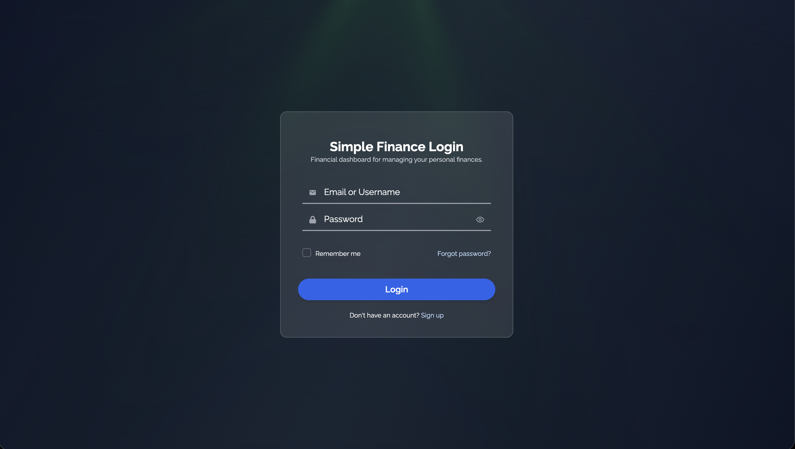
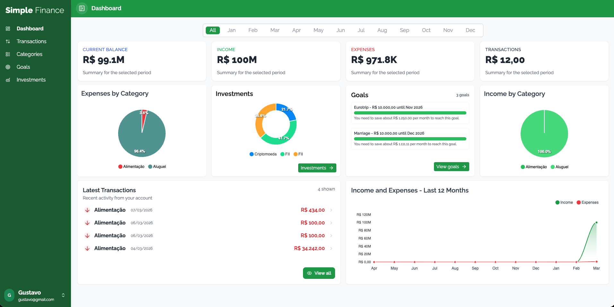

# Simple Finance

> A full-stack personal finance app with .NET 8 (Web API) and React + Vite.

<p align="center">
	
	
</p>

Simple Finance helps you track income, expenses, categories, goals and investments in a clean dashboard, with JWT authentication and a modern UI.

## Features

- 🔐 Authentication with JWT (register, login, protected routes)
- 💸 Transactions (income/expense) with categories and filtering
- 🏷️ Categories with default seed and per-user management
- 🎯 Financial goals with progress insights
- 📈 Dashboard with income/expense charts and latest transactions
- 💼 Investments overview (pie chart)

## Tech stack

- **Backend**: ASP.NET Core 8, Entity Framework Core, PostgreSQL, JWT auth, Swagger
- **Frontend**: React, Vite, TypeScript, Tailwind CSS, Axios

## Project structure

- `Backend/` – ASP.NET Core Web API
- `Frontend/` – React app (Vite)

## Prerequisites

- .NET SDK 8.x
- Node.js 18+ (or 20+)
- PostgreSQL (local or container)

## Configuration

Backend settings live in `Backend/appsettings.json`:

- Connection string: `ConnectionStrings:DefaultConnection`
- JWT settings: `Jwt:Key`, `Jwt:Issuer`, `Jwt:Audience`

Frontend API base URL is in `Frontend/src/services/api.ts`:

- `baseURL: http://localhost:5022/api`

If you change ports, update both the frontend base URL and the CORS origin in `Backend/Program.cs` (policy `AllowFrontend`).

## Run the backend

From the repository root:

```bash
cd Backend
dotnet restore
dotnet run
```

## Run the frontend

From the repository root:

```bash
cd Frontend
npm install
npm run dev
```

The app runs at `http://localhost:3000` by default.

## Typical local flow

1. Start the backend
2. Start the frontend
3. Use the UI to register and log in

## Notes

- The backend enforces JWT authentication. The frontend stores the token in `localStorage` under `auth_token` and sends it as a Bearer token.
- If PostgreSQL is not available, update the connection string to your environment.
